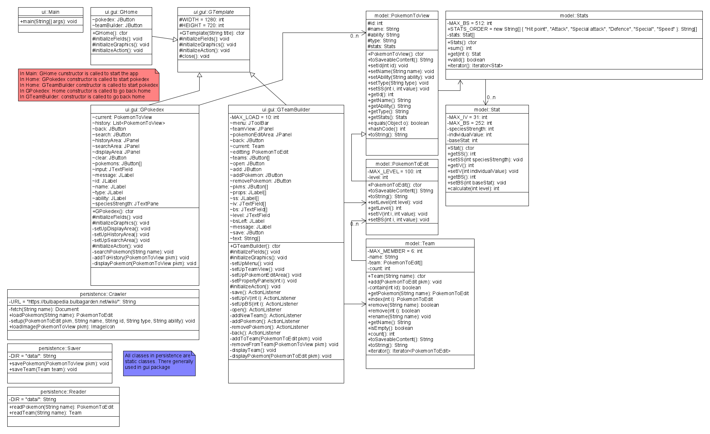

# Project 
## General introduction
This is a pokemonToView team builder application for Pokemon gamers. users can look up pokemonToView data and configure and save their configuration to a team. *pokemonToView stats* in the game has been derived into 6 stats each with 3 corresponding hidden value **species strength**, **individual value** and **base stats**.
In this application, user can edit these 3 hidden values and see how the result **pokemonToView stats** come out to be.

## Phase 1 Functionality
1. User can search and look up pokemonToView data using the pokedex mode
    - Enter the Pokemon name to search for corresponding pokemonToView
2. User can Build and manage thier pokemonToView team
    - User could add new teams
    - User could add new pokemonToView to the team
3. User can export thier team file
    - Pokemon and team data files are stored in *data* folder
4. User can read and edit pokemonToView team from a team file
    - Pokemon and team data files are stored in *data* folder

## Phase 2 Update
1. User can now get pokemonToView data from https://bulbapedia.bulbagarden.net
2. The program would automatically save the crawled data to the *data* folder
3. Added rules to pokemonToView edittings

## Phase 3 GUI
- There are 2 modes in current version
- Pokedex Mode:
    - User can search up pokemons
    - The software currently can only show several basic stats and species strength stats...I am working on crawling the images
    - Pokemons has been searched would appears in the search history list
    - Click on the poekmons in the search history if you want look at its stats 
    - History list can only hold up to 10 different pokemons
- Team Builder Mode:
    - User can edit pokemons in there team 
    - User can create there teams by hitting *new* button
    - User can open teams by hitting the *open* button, and that would open a file explore
    - User can save there team with save button

## Phase 3 To graders
- **Grade point 1** You can add pokemons to your team by clicking on add Pokemon button under Team Builder mode
- **Grade point 2** Event: you can click on the history bars to view pokemons you had searched before
- **Grade point 3** Event: you can open a file explorer and while you hit open button under Team Builder mode
- **Grade point 4** AV Component: The Home windows now have image covers for different modes
- **Grade point 5** You can save/load using the save/open button under Team Builder Mode

## Phase 4 Task 2
- I designed few robust  functionality in this program
    - A StatInvalidException is thrown if the stat you entered to change is out of boundary
    - that is
        - 0 < lv < 101 for level
        - -1 < iv < 32 for individual values
        - -1 < bs < 253 for basic stats
        - sum(all bs) < 513
    - A TeamFullException is thrown if you try to add pokemon to a full team
    - The max number of pokemons in a team is 6

## Phase 4 Task 3
- **Refector 1:** I used to have 3 Properties object holding speciesStrength, individualValues and baseStats separately for one Pokemon object. That could result in a very tight couple and redundant code
    - To fix that, I now have a single class Stat hold all 3 values, and a Stats class to hold the 6 Stat objects for a pokemon
- **Refector 2:** I made the team and Stats iterable, so that it can now iterate trough a team or a Stats object using forEach loop. That could avoid the use of multiple getter and setter function calls.
- **UML Graph**

## Further functionality to be implemented
- Scramble battle information online
- Danmage calculator
- Battle simulator
- Adding auto-teaming algorithm
